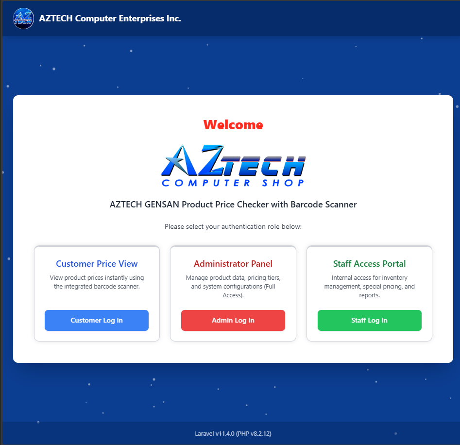

## Laravel + Tailwind Css Starter Project with Multi-Auth (Admin / Teacher and User )

**Project Screenshot**


- Admin login ( http://localhost:8000/admin/login )
- Staff login (http://localhost:8000/teacher/login )
- User login (http://localhost:8000/login )

---

## How to Run the Code

Follow these steps to set up and run the application locally:

1.  **Clone the Repository:**
    ```bash
    git clone https://github.com/ajayyadavexpo/laravel-11-multi-auth.git
    ```

2.  **Navigate to the Project Directory:**
    ```bash
    cd laravel-11-multi-auth
    ```

3.  **Configure Environment:**
    ```bash
    cp .env.example .env
    ```

4.  **Install Dependencies:**
    ```bash
    composer install
    ```

5.  **Generate Application Key:**
    ```bash
    php artisan key:generate
    ```

6.  **Run Migrations (Database Setup):**
    ```bash
    php artisan migrate:fresh
    ```

7.  **Start the Development Server:**
    ```bash
    php artisan serve
    ```
